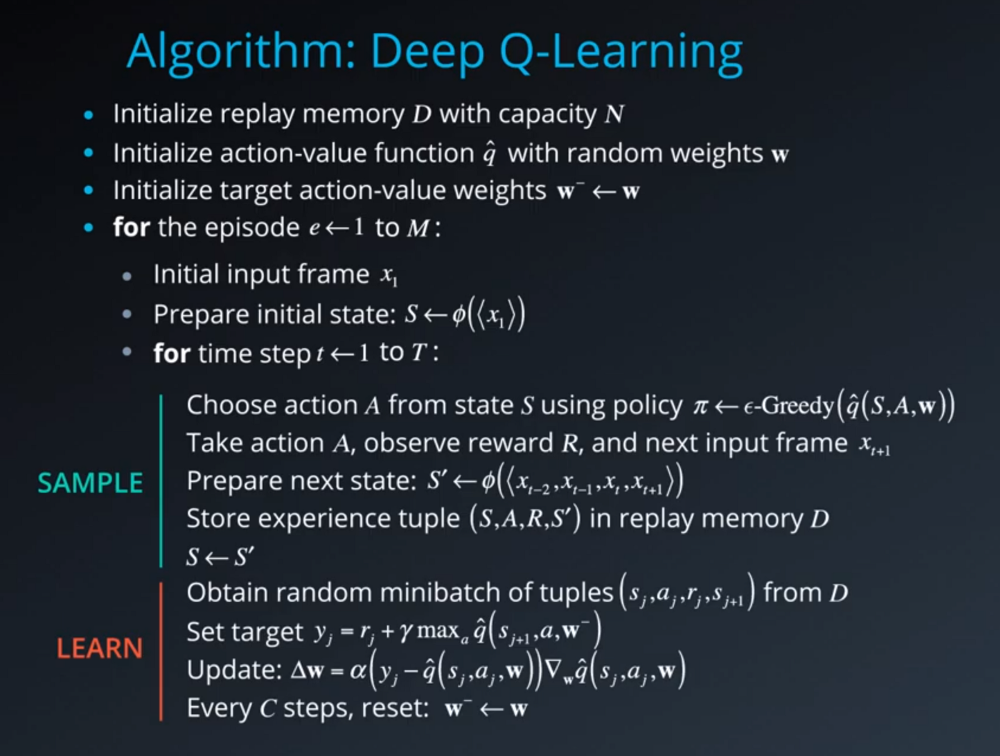

# Navigation Project - Udacity DRL Nano Degree

## General Overview

This report is dedicated to detail the work achieved during the first project of Udacity’s DRL Nanodegree.
The objective of this project is is to train an agent to collect yellow bananas while avoiding the blue ones using Unity's ML-agents environment.

## Project Structure
The code here is structured as followed:

```
📦Navigation-DRLND
 ┣ 📜.gitignore
 ┣ 📜.pre-commit-config.yaml
 ┣ 📜Navigation.ipynb
 ┣ 📜README.md
 ┣ 📜Report.md
 ┣ 📜banana.gif
 ┣ 📜banana_navigator.py
 ┣ 📜config.py
 ┣ 📜dqn_agent.py
 ┣ 📜environment.yml
 ┣ 📜evaluate.py
 ┣ 📜model.pth
 ┣ 📜qnetwork.py
 ┣ 📜result.png
 ┣ 📜train.py
 ┗ 📜unity-environment.log
 ```

 - `dqn_agent.py`: a DQN Agent class along with the replay buffer.
 - `qnetwork.py`: a PyTorch deep neural QNetwork class.
 - `train.py`: file used to launch the agent training.
 - `evaluate.py`: file used to launch the agent evaluation.
 - `banana_navigator.py`: main file to launch the training or the evaluation.

 ## Learning Algorithm

 In this project, we implemented a value based DRL method called Deep QNetwork. It's basically the combination of two approaches:
- Reinforcement Learning method called Q Learning.
- Deep learning network consisting of a fully connected layers to estimate the Q table.

The DQN algorithm is as follows:



## Model architecture
The neural network used consists of:
- 3 fully connected layers.
- Relu activate function layers.
- Output layer with size equal to number of actions.

## Hyperparameters

```python
BUFFER_SIZE = int(1e5) #replay buffer size
BATCH_SIZE = 64
GAMMA = 0.99 #discount factor
TAU = 1e-3 #coef for soft update
LR = 5e-4 #learning rate
UPDATE_EVERY = 4 #rate of network update
```

```python
N_EPISODES = 1400 #max episode number
MAX_T = 1000 #max timestep/episode
EPS_START = 1.0 #epsilon starting value
EPS_END = 0.01 #epsilon ending value
```
